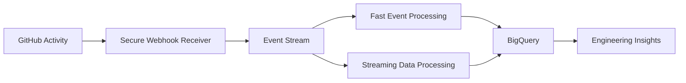
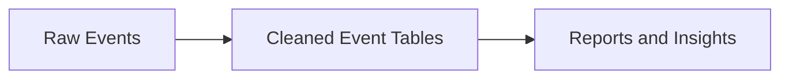

# FlowOps

**A real-time platform for understanding how software teams work, deliver changes, and respond to failures**

FlowOps turns everyday GitHub activity into useful operational insight.

It captures important engineering events such as code updates, pull requests, and workflow results, then organizes them into clear data that can support reporting, monitoring, and future alerts.

The platform is built on Google Cloud and is designed to show how modern software delivery activity can be collected, processed, and analyzed in one place.

---

## Why FlowOps Matters

Software teams generate a lot of activity every day:

- developers push code
- teams open and review pull requests
- automated tests run
- workflows succeed or fail
- deployment activity changes over time

Most of this information exists in separate pages, logs, and tools. That makes it difficult to see the full picture.

FlowOps brings these events together so a team can better understand:

- how active each repository is
- how often code is changed
- how many pull requests are opened and merged
- which workflows fail most often
- whether engineering activity is being captured reliably
- where delays or repeated problems may be happening

---

## What the Platform Does

FlowOps listens for selected GitHub events and processes them in near real time.

It currently tracks:

- **Push events** — when new code is uploaded
- **Pull request events** — when changes are opened for review, updated, merged, or closed
- **Workflow run events** — when GitHub Actions starts, succeeds, fails, or is cancelled

It then:

1. checks that the event really came from GitHub
2. standardizes the information
3. sends it through a reliable event channel
4. stores valid events for analysis
5. separates invalid events for investigation
6. prevents duplicate Cloud Run processing
7. prepares the data for reporting and future alerts

---

## How FlowOps Works



In simple terms:

```text
GitHub activity
→ FlowOps receives the event
→ the event is checked
→ the event is processed
→ the result is stored
→ the data becomes ready for analysis
```

---

## Two Processing Paths

FlowOps uses two processing approaches because they serve different needs.

### Fast serverless processing

```text
GitHub
→ Cloud Run
→ Pub/Sub
→ Cloud Run
→ Firestore
→ BigQuery
```

This path is suitable for lightweight, event-by-event processing.

It is efficient because Cloud Run can scale down when it is not being used.

### Managed streaming processing

```text
GitHub
→ Cloud Run
→ Pub/Sub
→ Apache Beam
→ Dataflow
→ BigQuery
```

This path is designed for larger streaming workloads and future capabilities such as:

- activity trends over time
- workflow failure rates
- repository health scores
- real-time engineering metrics
- event correlation

---

## Key Capabilities

### Secure event capture

FlowOps verifies GitHub webhook signatures before accepting events.

This helps ensure that the platform only processes trusted webhook requests.

### Real-time event distribution

Google Cloud Pub/Sub distributes each event to the services that need it.

This allows the same GitHub event to support more than one processing path.

### Duplicate protection

The Cloud Run processing path uses Firestore to help prevent repeated event deliveries from creating duplicate records.

### Invalid-event handling

Malformed or incomplete events are not silently discarded.

They are stored separately so they can be investigated later.

### Analytical storage

BigQuery stores the event data in layers designed for:

- raw record preservation
- cleaned event tables
- reporting and analytics

### Infrastructure automation

Terraform is used to define and manage the cloud resources required by the platform.

This makes the environment easier to recreate, review, and maintain.

---

## Supported GitHub Events

## Push Events

A push event happens when a developer uploads commits to GitHub.

Example:

```powershell
git push origin main
```

FlowOps can use push events to understand:

- which repository changed
- which branch was updated
- who pushed the change
- how often code is being updated
- whether a workflow failure followed the change

---

## Pull Request Events

A pull request is a request to review and merge changes from one branch into another.

FlowOps can capture pull request activity such as:

- opened
- updated
- reopened
- closed
- merged

This can support questions such as:

- how many pull requests are opened
- how many are merged
- how long reviews take
- which repositories have delayed reviews
- how active collaboration is across the team

---

## Workflow Run Events

A workflow run is one execution of a GitHub Actions workflow.

This may include:

- automated testing
- code-quality checks
- build processes
- deployment steps
- security checks

FlowOps can record whether a workflow was:

- queued
- running
- completed
- successful
- failed
- cancelled

This makes it possible to analyze workflow reliability over time.

---

## Business Questions FlowOps Can Support

FlowOps is designed to help answer practical engineering questions such as:

### Team activity

- Which repositories are most active?
- How often is code being pushed?
- Which branches receive the most changes?

### Pull request performance

- How many pull requests are opened each week?
- How many are merged?
- How long do reviews take?
- Which repositories have the slowest review process?

### Workflow reliability

- Which workflows fail most often?
- What is the workflow success rate?
- Are failures increasing over time?
- Which repositories have unstable automation?

### Platform reliability

- Are GitHub events arriving successfully?
- Are any events failing validation?
- Are messages building up in Pub/Sub?
- Are duplicate events being controlled?
- Are any Dataflow jobs running unnecessarily?

---

## Data Organization

FlowOps stores information in three main layers.



### Raw layer

Stores the original event information for:

- audit
- investigation
- replay
- future transformation changes

### Standardized layer

Extracts useful fields from the original event.

Examples include:

- repository
- branch
- author
- pull request number
- workflow name
- workflow result

### Analytics layer

Prepares the data for reporting and decision-making.

Examples may include:

- event totals
- activity trends
- pull request throughput
- workflow success rate
- repository health measures

---

## Main Technologies

| Area | Technology | Role in FlowOps |
|---|---|---|
| Application | Python and FastAPI | Receives and processes events |
| Event delivery | Google Cloud Pub/Sub | Moves events between services |
| Streaming | Apache Beam and Dataflow | Processes live event streams |
| Data storage | BigQuery | Stores and analyzes event data |
| Processing state | Firestore | Helps prevent duplicate processing |
| Hosting | Cloud Run | Runs the platform services |
| Infrastructure | Terraform | Creates and manages cloud resources |
| Secrets | Secret Manager | Protects the webhook secret |
| CI/CD | GitHub Actions | Runs automated workflows and tests |
| Monitoring | Cloud Logging and Monitoring | Supports operational visibility |

---

## Google Cloud Setup

The current development environment uses:

```text
Project: flowops-dev
Region: us-central1
```

Main services include:

- Cloud Run
- Pub/Sub
- Dataflow
- BigQuery
- Firestore
- Secret Manager
- Cloud Storage
- Cloud Logging
- Cloud Monitoring
- IAM
- Artifact Registry
- Cloud Build

---

## Repository Structure

```text
flowops/
├── services/                  Application services
├── pipelines/beam/            Streaming pipeline
├── infrastructure/terraform/  Cloud infrastructure
├── sql/                       BigQuery transformations
├── tests/                     Automated tests
├── docs/                      Project documentation
├── architecture/              Architecture views
├── runbooks/                  Operating procedures
├── .github/workflows/         GitHub Actions workflows
└── README.md
```

---

## Getting Started

### Requirements

Install:

- Python 3.12
- Google Cloud CLI
- Terraform
- Git
- GitHub CLI
- Docker

Authenticate with Google Cloud:

```powershell
gcloud auth login
gcloud auth application-default login
```

Set the project:

```powershell
gcloud config set project flowops-dev
gcloud config set run/region us-central1
```

Create a virtual environment:

```powershell
python -m venv .venv
.\.venv\Scripts\Activate.ps1
```

Install dependencies:

```powershell
pip install -r requirements.txt
```

---

## Deploying the Infrastructure

Move to the Terraform environment:

```powershell
Set-Location infrastructure\terraform\environments\dev
```

Run:

```powershell
terraform init
terraform fmt
terraform validate
terraform plan
terraform apply
```

A fully aligned environment should return:

```text
No changes. Your infrastructure matches the configuration.
```

---

## Running the Platform

### Run the webhook receiver locally

```powershell
uvicorn services.webhook_receiver.app.main:app --reload
```

Local address:

```text
http://127.0.0.1:8000
```

### Check deployed Cloud Run services

```powershell
gcloud run services list `
    --project=flowops-dev `
    --region=us-central1
```

### Start Dataflow

Dataflow is started only when managed streaming is required.

```powershell
$SetupFile = (Resolve-Path pipelines\beam\setup.py).Path
$JobName = "flowops-stream-" + (Get-Date -Format "yyyyMMdd-HHmmss")
```

```powershell
python -m flowops_beam.pipeline `
    --input-mode pubsub `
    --subscription "projects/flowops-dev/subscriptions/flowops-beam-stream-sub" `
    --output-mode bigquery `
    --valid-table "flowops-dev:flowops_raw.github_events_beam" `
    --invalid-table "flowops-dev:flowops_raw.invalid_events_beam" `
    --runner DataflowRunner `
    --project flowops-dev `
    --region us-central1 `
    --job_name $JobName `
    --staging_location "gs://flowops-dev-dataflow-523123766839/staging" `
    --temp_location "gs://flowops-dev-dataflow-523123766839/temp" `
    --service_account_email "flowops-dataflow-worker@flowops-dev.iam.gserviceaccount.com" `
    --setup_file $SetupFile `
    --streaming `
    --num_workers 1 `
    --autoscaling_algorithm NONE `
    --worker_machine_type "e2-standard-2" `
    --worker_zone "us-central1-b"
```

### Stop Dataflow after testing

List active jobs:

```powershell
gcloud dataflow jobs list `
    --project=flowops-dev `
    --region=us-central1 `
    --status=active `
    --format="table(id,name,state)"
```

Cancel a job:

```powershell
gcloud dataflow jobs cancel DATAFLOW_JOB_ID `
    --project=flowops-dev `
    --region=us-central1
```

---

## Testing

Run the automated tests:

```powershell
pytest
```

Run the Beam tests:

```powershell
pytest pipelines\beam\tests
```

The platform has already been tested with:

- a real push event
- a real pull request event
- a real workflow run
- a controlled workflow failure
- a malformed Pub/Sub message
- dead-letter routing
- local Beam processing
- managed Dataflow processing

---

## Example Data Queries

### Recent events

```sql
SELECT
    event_type,
    repository,
    received_at,
    processing_status
FROM `flowops-dev.flowops_raw.github_events_beam`
ORDER BY beam_processed_at DESC
LIMIT 20;
```

### Workflow failures

```sql
SELECT
    repository,
    JSON_VALUE(payload, '$.workflow_run.name') AS workflow_name,
    JSON_VALUE(payload, '$.workflow_run.conclusion') AS conclusion,
    received_at
FROM `flowops-dev.flowops_raw.github_events_beam`
WHERE event_type = 'workflow_run'
  AND JSON_VALUE(payload, '$.workflow_run.conclusion') = 'failure'
ORDER BY received_at DESC;
```

### Invalid events

```sql
SELECT
    error_type,
    error,
    failed_at
FROM `flowops-dev.flowops_raw.invalid_events_beam`
ORDER BY failed_at DESC
LIMIT 20;
```

---

## Security

FlowOps includes several security controls:

- signed GitHub webhook verification
- protected secret storage
- private internal processing services
- authenticated Pub/Sub delivery
- separate service accounts
- least-privilege permissions
- no secrets stored in Git

Only the webhook receiver is public.

The event processor, data services, and internal resources remain protected within Google Cloud.

---

## Reliability

The platform includes:

- Pub/Sub message retention
- automatic retries
- dead-letter routing
- duplicate protection
- invalid-event isolation
- raw event preservation
- independent processing subscriptions
- Terraform-based recovery

These features help reduce data loss and make failures easier to investigate.

---

## Cost Control

The main cost risk is a Dataflow streaming job that remains active.

The project controls cost by:

- using one worker during tests
- disabling autoscaling for small tests
- starting Dataflow manually
- stopping Dataflow immediately after testing
- using Cloud Run services that scale down when idle
- using partitioned and clustered BigQuery tables
- keeping event volume low during development

Always check for active Dataflow jobs after testing.

---

## Connecting Another GitHub Repository

FlowOps can receive events from multiple repositories.

To connect another repository:

1. Open the repository in GitHub.
2. Go to **Settings → Webhooks**.
3. Select **Add webhook**.
4. Enter the FlowOps webhook URL.
5. Choose `application/json`.
6. Enter the webhook secret.
7. Select:
   - Pushes
   - Pull requests
   - Workflow runs
8. Save the webhook.
9. Send test events.
10. Confirm the repository appears in BigQuery.

The `repository` field keeps data from different repositories separate.

---

## Current Project Status

FlowOps is already functional as a controlled development and portfolio platform.

The following flows have been proven:

```text
GitHub
→ Cloud Run
→ Pub/Sub
→ Cloud Run
→ Firestore
→ BigQuery
```

and:

```text
GitHub
→ Cloud Run
→ Pub/Sub
→ Dataflow
→ BigQuery
```

The project has also demonstrated:

- real GitHub event capture
- secure webhook validation
- duplicate control
- invalid-event handling
- dead-letter processing
- Terraform infrastructure management
- managed streaming execution
- BigQuery analytical storage

---

## Roadmap

### Next phase

- workflow failure alerts
- repository health metrics
- pull request cycle-time reporting
- workflow success-rate dashboards
- improved visual reporting
- architecture images

### Future phase

- advanced Beam windows
- push-to-workflow correlation
- GitHub App onboarding
- automated Dataflow deployment
- Slack or email alerts
- formal service-level objectives
- multi-environment deployment
- production security hardening

---

## Documentation

| Document | Purpose |
|---|---|
| [Project Overview](docs/01-project-overview.md) | Project purpose and business value |
| [System Architecture](docs/02-system-architecture.md) | Platform components |
| [Event Flow](docs/03-event-flow.md) | How events move through FlowOps |
| [Data Architecture](docs/04-data-architecture.md) | Data layers and storage |
| [Infrastructure](docs/05-infrastructure.md) | Google Cloud resources |
| [Deployment Guide](docs/06-deployment-guide.md) | Platform setup |
| [Testing Guide](docs/08-testing-guide.md) | Validation procedures |
| [Operations Runbook](docs/09-operations-runbook.md) | Routine operations |
| [Security](docs/11-security.md) | Security controls |
| [Troubleshooting](docs/13-troubleshooting.md) | Common issues and fixes |
| [Roadmap](docs/18-roadmap.md) | Planned improvements |

---

## What This Project Demonstrates

FlowOps demonstrates practical experience in:

- cloud data engineering
- event-driven systems
- real-time data processing
- Apache Beam and Dataflow
- serverless application design
- data quality and reliability
- BigQuery data modelling
- infrastructure as code
- cloud security
- CI/CD monitoring
- operational troubleshooting

It is both a working engineering platform and a portfolio project designed to show how software-delivery data can be transformed into useful operational intelligence.
