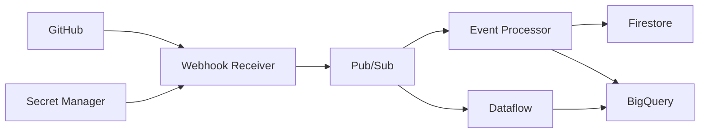

# Container Architecture

| Container | Purpose |
|---|---|
| Webhook receiver | Secure event ingestion |
| Pub/Sub | Event transport |
| Event processor | Serverless validation and storage |
| Dataflow | Distributed stream processing |
| Firestore | Idempotency state |
| BigQuery | Analytical storage |
