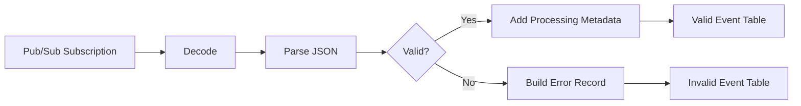

# Dataflow Pipeline

```mermaid
flowchart LR
    PS[Pub/Sub Subscription] --> DEC[Decode]
    DEC --> PARSE[Parse JSON]
    PARSE --> VAL{Valid?}
    VAL -->|Yes| ENRICH[Add Processing Metadata]
    ENRICH --> BQ1[Valid Event Table]
    VAL -->|No| ERR[Build Error Record]
    ERR --> BQ2[Invalid Event Table]
```

The pipeline supports local DirectRunner tests and managed DataflowRunner execution.
