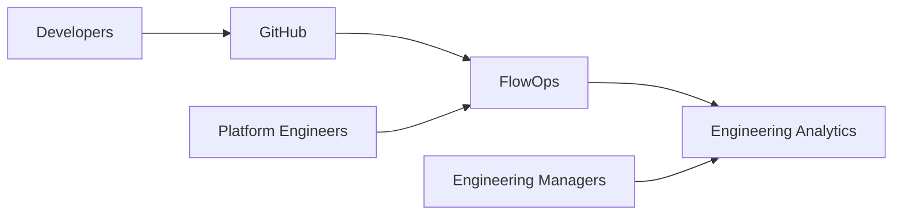

# System Context

```mermaid
flowchart LR
    DEV[Developers] --> GH[GitHub]
    GH --> FO[FlowOps]
    FO --> BQ[Engineering Analytics]
    OPS[Platform Engineers] --> FO
    MGR[Engineering Managers] --> BQ
```

FlowOps receives GitHub engineering events and converts them into reliable analytical data for developers, platform teams, and engineering managers.
