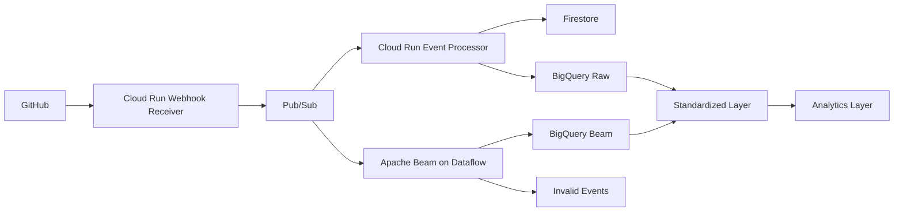

# FlowOps System Architecture

## Overview



## Components

| Component | Responsibility |
|---|---|
| GitHub | Produces push, PR, and workflow events |
| Webhook receiver | Verifies signatures and publishes events |
| Pub/Sub | Buffers and distributes events |
| Event processor | Validates, deduplicates, and stores events |
| Firestore | Stores idempotency state |
| Beam/Dataflow | Performs managed stream processing |
| BigQuery | Stores raw, standardized, and analytical data |
| Secret Manager | Stores the webhook secret |
| Terraform | Manages cloud infrastructure |

## Processing Paths

### Serverless path

```text
GitHub → Cloud Run → Pub/Sub → Cloud Run → Firestore → BigQuery
```

Best for lightweight event-by-event processing and low idle cost.

### Streaming path

```text
GitHub → Cloud Run → Pub/Sub → Dataflow → BigQuery
```

Best for distributed processing, windows, aggregation, and future real-time metrics.

## Security Boundaries

- Only the webhook receiver is public.
- GitHub requests require a valid HMAC signature.
- The event processor is private.
- Pub/Sub invokes the processor using a service account.
- Secrets are stored in Secret Manager.
- Services use separate least-privilege identities.

## Region

```text
GCP project: flowops-dev
Primary region: us-central1
```
