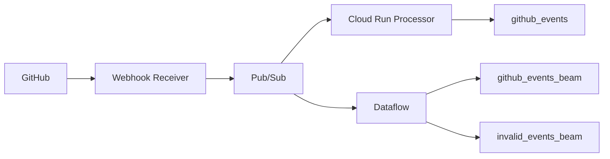

# FlowOps Event Flow

## End-to-End Flow

## Processing Steps

1. A push, pull request, or workflow event occurs in GitHub.
2. GitHub sends a signed webhook.
3. Cloud Run verifies the signature and creates a standard event envelope.
4. Pub/Sub distributes the event to independent consumers.
5. Cloud Run writes validated events to BigQuery and uses Firestore for duplicate control.
6. Dataflow writes valid and invalid events to separate BigQuery tables.

## Event Uses

| Event | Main use |
|---|---|
| Push | Track code and branch activity |
| Pull request | Measure review and merge activity |
| Workflow run | Monitor CI/CD success and failure |

## Failure Handling

- Pub/Sub retries failed Cloud Run deliveries.
- Repeated failures can move to the dead-letter topic.
- Beam parsing failures are written to `invalid_events_beam`.
